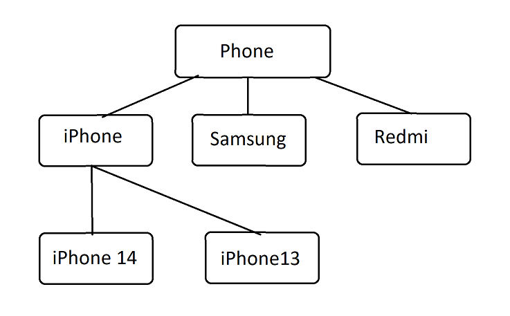
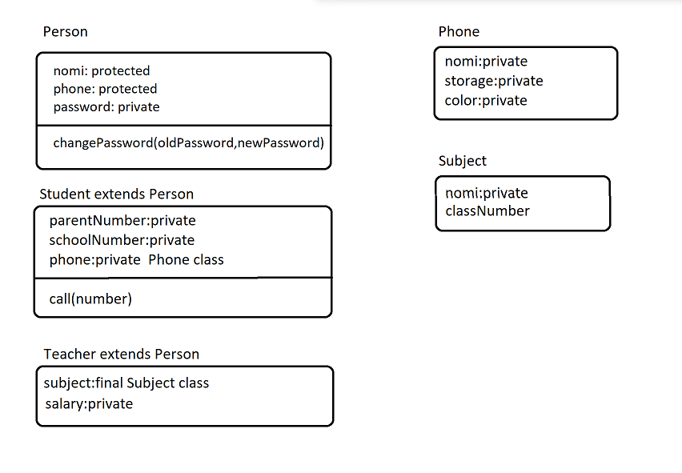
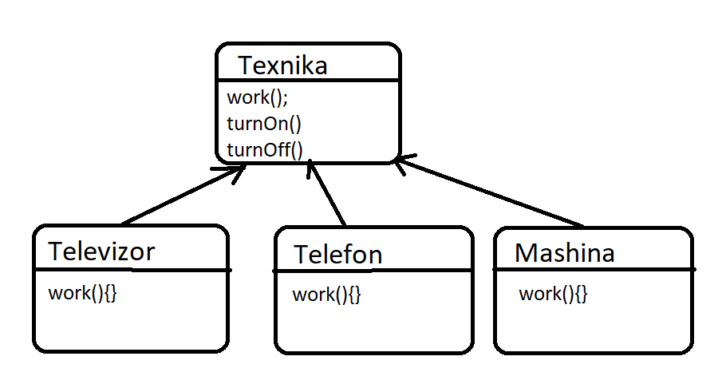
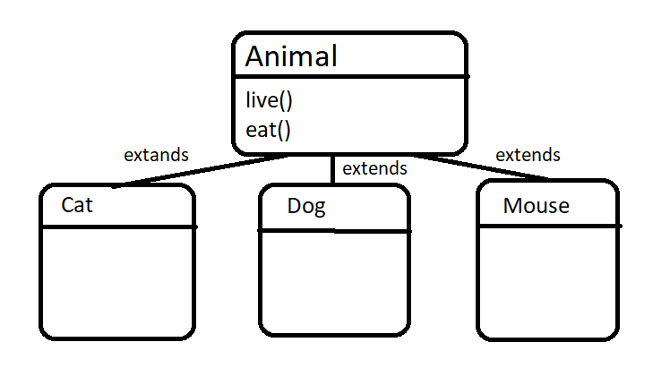
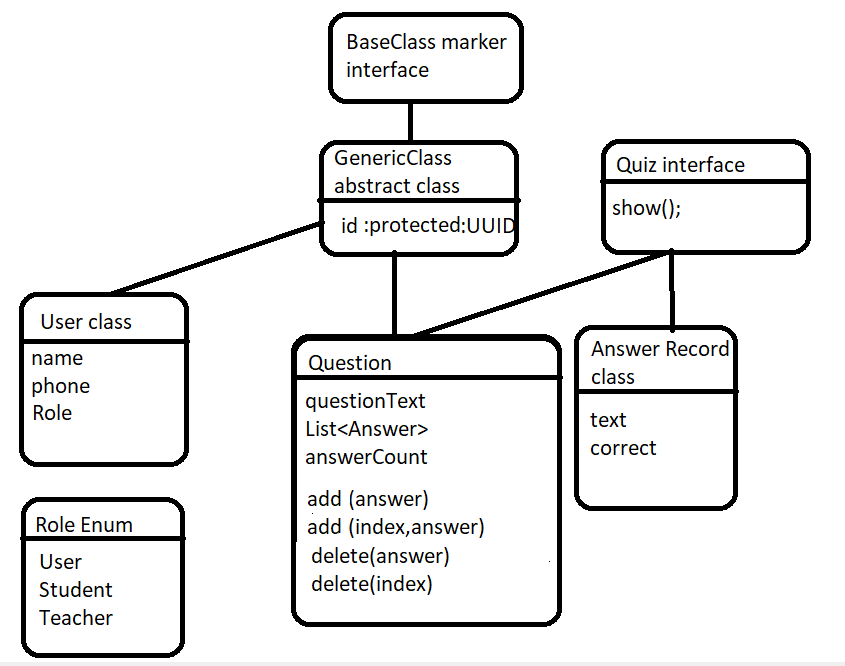

# Ikkinchi Modul uchun Mashqlar

Lesson 1

<ul>

1. Book Class - Oson

* Kitob classini yarating
* Nomi, Muallifi, SahifaSoni nomli fieldlari bo'lsin
* Nom, muallifi, sahifaSoni malumotlarini chiqaruvchi
  print method bo'lsin va ekranga malumotlar chiqarilsin

</ul>

<ul>

2. Kalkulator class - Qiyin

* Kalkulator classi yaratilsin
* 2ta sonni saqlovchi first va second , belgi saqlovchi sign va natijani saqlochi result fieldi bo'lsin
* calculate methodi bo'lsin . First va second methodi sign orqali qiymatlarni hisoblasin.
  Masalan: signni qiymati ( + ) bo'ladigan bo'lsa first va secondni yi'gindisini resultga o'zlashtirsin;
* Print methodi ham bo'lsin. Malumotlarni "first sign second = result" ko'rinishida chop etsin

</ul>

<ul>

3. Todo Class - Juda Qiyin

* Todo Classi yaratilsin
* Nomi, tugash muddatini anglatuvchi day(kun),
  bajarilgani yoki yo'qligini bildiradigan isComplete(bajarilganmi),
  todo ni o'chirilgan yoki yo'qligini bildiruchi isDeleted(o'chirilganmi) nomli fieldlari bo'lsin.
* done(bajarildi), deleted(o'chirildi) va malumotlarni "Nomi day isCompleted" ko'rinishida print nomli methodlari bo'
  lsin.
* objectlar massivda saqlansin va ochilmaganlarini consolega chizing.

</ul>

Lesson 2

<h3> Har bir topshiriq com.pdp.online.task.number o'ziga hos package yo'llarida yozilsin!</h3>

Masalan: com.pdp.online.task.one.Rectangle, com.pdp.online.task.two.User
<ul>

1. Rectangle(to'rtburchak) Class - Oson

* Width, height va result fieldlari bo'lgan Rectangle classini encapsulation prinsipi asosida yarating
* result ga to'rtburchakning yuzi hisoblanib o'zlashtiradigan calculate methodi bo'lsin
* "width * height = reult" ko'rinishida consolega chop etilsin.

</ul>
<ul>

2. User Class - Oson

* Ism, Familya, PhoneNumber, Age va isMale fieldlari bo'lgan User classini encapsulation prinsipi asosida yarating
* "Ismi: Familya Ism, yoshi: age, telefoni raqami: phoneNumber, Jinsi: isMale" ko'rinishida consolega chop etilsin.

</ul>
<ul>

3. ClassRoom Class - Qiyin

* roomNumber,teacherName,teacherPhoneNumber, studentName (bittadan ko'p bo'ladi) va studentCount
  fieldlari bo'lgan ClassRoom classini encapsulation prinsipi asosida yarating
* Malumotlar console orqali kiritilsin.
* roomnumber, teacherNmae va studentlarini chop eting

</ul>
<ul>

3. Pen Class - Juda Qiyin

* miqdor,clicked va oneLetter fieldlari bo'lgan Pen Classi encapsulation prinsplariga asoslangan holda yaratilsin.
* Miqdor -> ruchkani siyohi qanchaligi
* Clicked -> ruchka bosilganmi yoki yo'q
* OneLetter -> bitta harf uchun qancha siyoh ketishi
* write methodi orqali ruchka yoshishni boshlasin. Katta harf yozilganda kichkina harfga qaraganda
  2 barobar siyoh sarflasin, agarda bo'sh joy keladigan bo'lsa siyoh sarflanmasin. Agar siyoh tugasa ruchka yozishdan
  to'xtasin va yozilgan text consolega chiqarilsin.

</ul>

 Lesson 3 

<ul>

1.Topshiriq - Oson

Rasmbda berilgan struktura asosida classlarni yarating.

</ul>
<ul>

2.Topshiriq - Juda Qiyin

* Rasmbda berilgan struktura asosida classlarni yarating.
* Bir necha Student objectlar dan tashkil topgan massiv yarating
* Studentdan yangi object yarating va osha object massiv ichida teng bolgan
  objectni topib, massiv ichidan topilgan Student objectini passwordini o'zgartiring.
* Ozgartiryapganda oldPassword oldingi passwordga teng bo'lsa yangisini o'zlashtiring

</ul>
<ul>

3.Topshiriq - Oson

* Rasmbda berilgan struktura asosida classlarni yarating.
* Bir necha Student objectlar dan tashkil topgan massiv yarating
* Studentdan yangi object yarating va osha object massiv ichida teng bolgan
  objectni topib, massiv ichidan topilgan Student objectini passwordini o'zgartiring.
* Ozgartiryapganda oldPassword oldingi passwordga teng bo'lsa yangisini o'zlashtiring

</ul>

Lesson 4

<ul>

1.Topshiriq - Oson

Har xil shaklarning premetrini hisoblovchi methodlari bor bo'lgan 
Figure classini polymorphismni overloading usulini qo’llagan holda yarating: 

* To'g'ri to'rtburchak(2 ta son beriladi)
* Uchburchak (3 ta son beriladi)
* Kvadrat (1 ta son beriladi)
* BeshBurchak (5 ta son beriladi)

</ul>
<ul>

2.Topshiriq - Qiyin

 Math classini o'zimiz polymorphism dan foydalanib yaratish.   
MyMath classini yarating. 2 ta sonni qoshuvchi methodlarni overloading qiling

* matn va sonni ni qo'shadigan
* matn va double ni qo'shadigan
* matn va matn ni qo'shadigan
* son va sonni ni qo'shadigan
* double va double ni qo'shadigan
* double va sonni ni qo'shadigan

</ul>
<ul>

3.Topshiriq - Oson

Rasmda berilgan struktura asosida klasslarni yarating. work() methodini overriding usulida amalga oshiring.

</ul>
<ul>

4.Topshiriq - Oson

Rasmda berilgan struktura asosida klasslarni yarating. live() va eat() methodlarini overriding usulida amalga oshiring.

</ul>

Lesson 5

<ul>

1.Topshiriq - Oson

* Person abstract classini yarating undan, Student,Techaer,Parent classlari extend oladin;
* Person classida name,phone,speak(),walk() methodlari bo'lsin;

</ul>

<ul>

2.Topshiriq - Qiyin

* Animal, Pet, Wild interfacelarini yarating;
* Lion, Dog, Cat, Bird classlarini yarating;
* Lion classi Animal va Wild interfacelaridan voris olsin;
* Dog va Cat classlari Animal va Ped interfacelaridan voris olsin
* Bird clasi esa faqat Animal interfacedan voris olsin

</ul>

<ul>

3.Topshiriq - Qiyin

* Texnika marker interfaceni yarating .
* Texnika interfacedan ndan Vehicle and Equipment abstract classlari voris olsin .
* Malibu, Spark classlari Vehicledan classidan voris olsin .
* WashingMachine va Television classlari Equipmentdan voris olsin .

</ul>

Lesson 6

<ul>

1.Topshiriq - Oson

* BigInteger classidan foydalanib kichkin calculator dasturini yasang .

</ul>
<ul>

2.Topshiriq - Oson

* BigDecimal classidan foydalanib kichkin pullarni valyuta boyicha almashtiradigan dastur yarating .
* Qiymatlarni esa String wrapper classiga berib qiymatni uzunligi bilan ekranga chiqaring

</ul>
<ul>

3.Topshiriq - Qiyin

* Parent classini yarating uning ichida bitta static va static bo'lmagan inner sinf yarating.
  Har bir inner class ichida bethod yaratib ularning ichida local inner class yarating

</ul>

Lesson 8

<ul>

1.Topshiriq - Oson

* Name,Author,PageCount,PriceBook fieldlari bo'lgan record classini yarating
* Object yaratib har birini ekranga chiqaring
* Object yaratilyapganda Compact constructorda berilgan qiymatlarni tekshiring
* Name va Auther bo'sh textga yoki nullga teng bo'ladigan bo'lsa yoki pageCount 0 dan kichim bo'ladigan bo'lsa
  xatolik haqida ekranga chiqarib keyin yaratilgan objectni chiqaring

</ul>

<ul>

2.Topshiriq - Oson

* regionName,DistrictName,homeNumber fieldlari bo'lgan Locatioin record classini yarating
* Name,Phone fieldlari va Location record classi bo'lgan User classini yarating
* Oldin ularga instance block orqali default qiymatlar bering Object yaratilganda qiymat berilmasa default qiymatni
  oladigan qiling
* va qiymatni ekranga chop eting

</ul>

Lesson 9

<ul>

1.Topshiriq - Qiyin

* O'lchamlarni saqlovchi Size nomli Enum classi yarating unda S,M,X,XL qiymatlari bo'lsin.
* Jinslarni saqlash uchun Gender Enumini yarating unda MALE,FEMALE qiymatlari bo'lsin
* Clothes nomli class yarating unda rangi va Size enumini ham saqlang
* Class yaratyapganda asosiy qoidalariga etibor bering
* Bir nechta Clothes classidan object yaratib ularni hammasini var keywordli o'zgaruvchilarga saqlang
* Hammasini ekranga chop eting

</ul>

<ul>

2.Topshiriq - Qiyin

* Asosit logikalar yozish uchun Application classini yarating.
* run() methodida hamma logikalar joylashtirilsin.
* Bu classni ishlatish uchun Singleton design patternidan foydalaning
* Buning uchun class ichida instance yaratuvchi va qaytaruvchi method yarating.
* Phone classini yarating name,model enum classi va storage fieldlarini salvochi
* Model enumida PHONE,SAMSUNG,REDMI qiymatlari bo'lsin
* instance orqali run methodini ishga tushuring

</ul>

Lesson 10

### Yakuniy Project
### Juda Qiyin

* Pasword va Userlarni saqlaydigan map yarating
* User dan 1.kirish yoki 2.registeratsiya qilish tanlovlarini so'rang
* Registratsiyani yani 2 ni bossa user malumotlarini to'ldirsin
* user kiritgan password Map da bo'ladigan bo'lsa
* InvalidPasswordExceptionni tashlang uni catching qilib message ni ekranga chiqaring
* Agar user 1 ni kirishni bossa Systemega kiryapganda userni passwordini so'rang
* shunaqa passwordli user mapdan topilsa agar topilmasa
* DontHaveAccessExceptionni tashlaydigan
* va u exceptionni tutib messageini ekranga print qiling
* Questionlarni saqlovchi list bo'lsin
* Systemaga muaffaqiyatli kirgan user Student yoki User bo'ladigan bo'lsa unga 2ta menu 1. Start, 2. Exit lar chiqsin
* Question listini bir ma bir "questionText -> answer text" ko'rinishida chop eting.
* Masalan :  2+2 = ? -> 1. 3 , 2. 5 , 3. 4,  4. 9
  Agar user 1 ni tanlasa demak 3 javobini bergan bo'ladi
* User tanlagan answerini anwer listdan toping va
* QuesitionText va answer ni saqlaydigan userAnswers mapiga saqlab keting
* Quiz oxirida userAnswers mapini "questionText siz tanlagan answer isCorrect" ko'rinishida ekranga chop eting
* Har safar question chop etilganda userdan answerl
* Agar systemaga kirgan Techer bo'ladigan bo'lsa quiz o'zgartirishlar kirita olsin yani
  unga 1.Create Quiz, 2. Delete Quiz, 3. Update Quiz, 4. List Quiz, 5. Exit tanlovlari berilsin
* 1 ni bosganda yangi question kirita olsin bir nechta natogri answer va togri answer bilan
* 2 ni bosganda questionni o'chira olsin
* 3 ni bosganda questionni update qila olsin
* 4 ni bosganda question listidagi elementlarni forEach orqali ekranga chop etilsin
* 5 ni bosganda systemadan chiqib ketsin.

