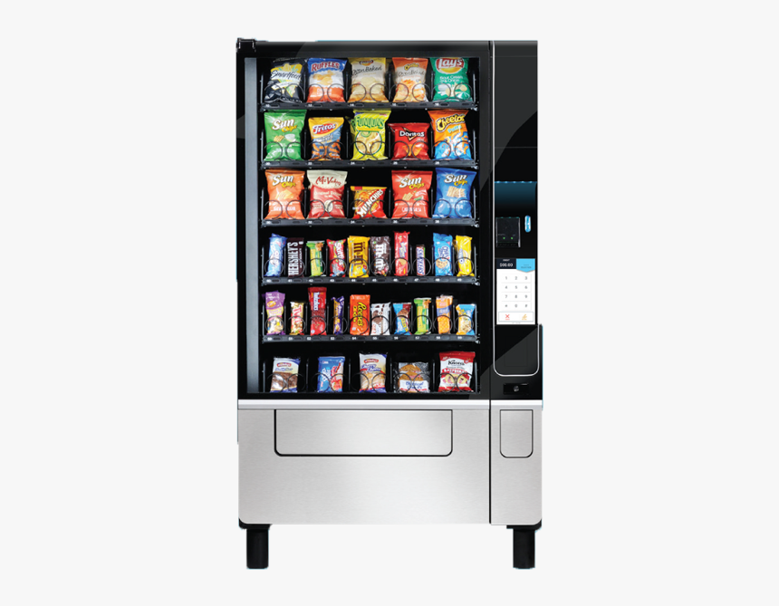

 

Lesson 1

1. PostgreSQL ni o'zingizni komputeringizga o'rnating.
2. PSQL ga ulangan xolda postgreSQL ni versiyasini tekshiring `select version();`

------

Lesson 2

1. **PSQL yordamida.** AuthUser degan table kiriting va ushbu tableda
    * id
    * username
    * email
    * phone
    * age

   degan columnlari bo'lsin va ushbu table ustida `insert, select, update, delete` querylarini ishlating
2. Yuqoridagi 👆 tabledagi username uchun **unique** va email uchun **unique not null** constraint lar qo'shing.
3. **Todo** degan Table yarating (id, title, owner_id) degan column lari bilan va ushbu **owner_id** ni **AuthUser** ga
   **foreign key** bilan uleng.

------

Lesson 3

1. **PSQL yordamida.** AuthUser degan table kiriting va ushbu tableda
    * id -> _uuid_
    * username -> _varchar_
    * email -> _varchar_
    * phone -> _varchar_
    * age -> _int_
    * role -> _enum type_

   degan columnlari bo'lsin va ushbu table ustida `insert, select, update, delete` querylarini ishlating

# www.hackerrank.com dagi 👇 masalarni yeching

3. https://www.hackerrank.com/challenges/revising-the-select-query/problem
4. https://www.hackerrank.com/challenges/select-all-sql/problem
5. https://www.hackerrank.com/challenges/japanese-cities-name/problem
6. https://www.hackerrank.com/challenges/weather-observation-station-1/problem

------

Lesson 4

# www.hackerrank.com dagi 👇 masalarni yeching

1. https://www.hackerrank.com/challenges/weather-observation-station-1/problem
2. https://www.hackerrank.com/challenges/more-than-75-marks/problem
3. https://www.hackerrank.com/challenges/name-of-employees/problem

------

Lesson 5

Qandaydir table yarating unda **mail**, **phone**, **password** degan column lari bo'lsin.
* **mail** - strong mail check bo'lsin 
* **phone** - `998 + 71, 87, 88, 90, 91, 93, 94, 99 + 7` ta raqamga tekshiradigan bo'lsin 
* **password**  - xech bo'lmaganda 1 ta kichik harf, 1 ta katta harf, 1 ta kichik raqam va xech bo'lmaganda `@#$%*()` belgilardan 1 ta bo'lsin va uzunligi 8 ta dan uzun bo'lsin.

------

Lesson 6

Qandaydir table yarating unda **mail**, **phone**, **password** degan column lari bo'lsin.
* **mail** - strong mail check bo'lsin 
* **phone** - `998 + 71, 87, 88, 90, 91, 93, 94, 99 + 7` ta raqamga tekshiradigan bo'lsin 
* **password**  - xech bo'lmaganda 1 ta kichik harf, 1 ta katta harf, 1 ta kichik raqam va xech bo'lmaganda `@#$%*()` belgilardan 1 ta bo'lsin va uzunligi 8 ta dan uzun bo'lsin.

------

Lesson 11(Project)

1. darsdagi **auth_login** va **auth_register** dagi funksiyalarda boshqa barcha funksiyalardagi exceptionlar shu funksiyani chaqiruvchi user ni tilida chiqsin ?  
2. **Vending Machine** ni **procedure** lar va **function** lar dan foydalanib yozing ?

## WARNING - BU MASHQ UCHUN TALAB MAVJUD EMAS O'ZINGIZ IJOD QILISHINGIZ KERAK BO'LADI!!!! 

------

