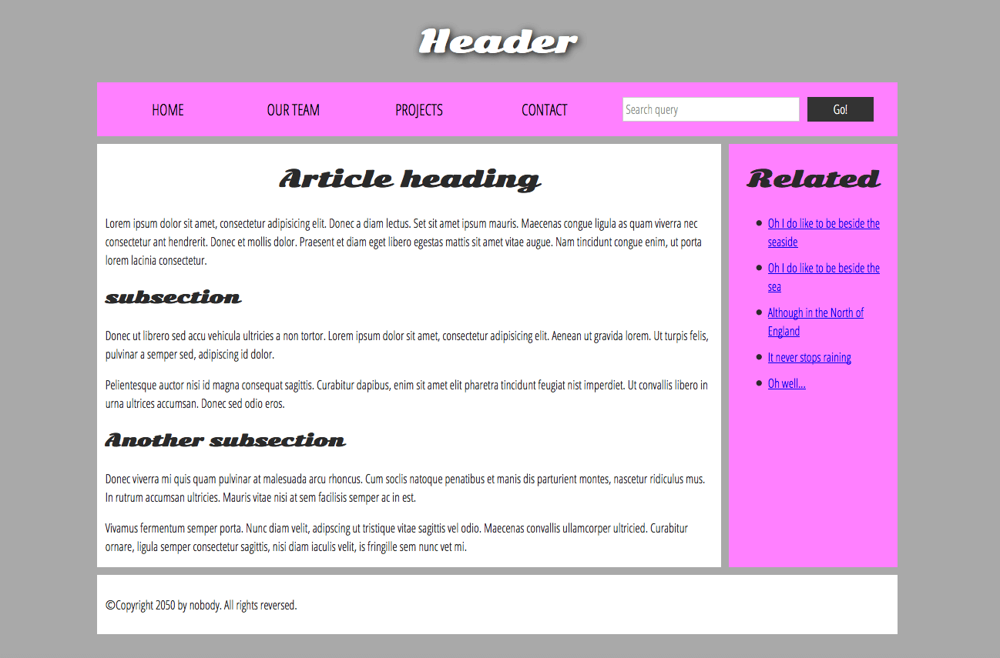

 <details>
<summary style="font-size:40px;">Lesson 1</summary>

1. Rasmdagi page ni HTML,CSS dan foydalanib yarating !
   
2. Yuqoridagi rasmdagi page ni HTML,BOOTSTRAP dan foydalanib yarating !
3. HTML, CSS, JS dan foydalanib calculator yarating ?

</details>

------

<details>
<summary style="font-size:40px;">Lesson 2</summary>

1. Qandaydir XYZ Servlet yarating ?
2. XYZ Servlet ni **xml** va **Annotation** yordamida deployment descriptor ga register qiling ?

</details>

------

<details>
<summary style="font-size:40px;">Lesson 3</summary>

1. **_Sonni_**  **Istalgan sanoq sistemasidan** (_2,8,10,16_) **Istalgan sanoq sistemasiga** (_2,8,10,16_) o'tkazadigan
   dasturni JSP va Servlet lardan foydalangan xolda yarating !

</details>

------

<details>
<summary style="font-size:40px;">Lesson 4</summary>

1. Rasmlar Galeriyasi Dasturini Yarating
    * Rasm Yuklay Oling
    * Va Yuklangan Barcha Rasmlarni gallery.jsp file da ko'rsatib bering.


</details>

------

<details>
<summary style="font-size:40px;">Lesson 5</summary>

# WARNING (quyidagi topshiriqlarni bajarishda ma'lumotlarni database ga yozish uchun JDBC API dan foydalanib yozing)

1. **Guruh** nomli class yarating va darsdagi book uchun qilingan **crud** kabi guruh ustida crud amalini bararuvchi
   dastur tuzing !
    * **Guruh** classida [_guruh nomi, guruh id, qachon yaratilganligi,talabalar soni_] kabi **field** lari
      bo'n !
2. **Talaba** nomli class yarating va darsdagi book uchun qilingan **crud** kabi guruh ustida crud amalini bararuvchi
   dastur tuzing !
    * **Talaba** classida [_talaba id, qachon yaratilganligi,talabani toliq ismi , talabani yoshi, guruh id si(qaysi
      guruhda o'qishligini ko'rsatib turishi uchun)_] kabi **field** lari bo'lsin !

## Masalan 👇👇👇👇

````java
import java.time.LocalDateTime;

class Group {
    private String id;
    private String name;
    private LocalDateTime createdAt;
    private int studentCount;
    // constructors, getters, setters
}

class Student {
    private String id;
    private String fullName;
    private LocalDateTime createdAt;
    private String groupID;
    private int age;
    // constructors, getters, setters
}
````

</details>

------

<details>
<summary style="font-size:40px;">Lesson 6</summary>

# WARNING (quyidagi topshiriqlarni bajarishda ma'lumotlarni database ga yozish uchun JDBC API dan foydalanib yozing)

1. **User** nomli class yarating va darsdagi book uchun qilingan **crud** kabi guruh ustida crud amalini bararuvchi
   dastur tuzing !
    * **User** classida [_user id, username_] kabi **field** lari bo'lsin !

# Masalan

````java
class User {
    private String id;
    private String username;
    //constructors, getters, setters 
} 
````

2. **Login Servlet yarating !**
    * **LoginServlet** ning **doGet** methodida `/views/login.jsp` ga forward qiling.
    * `/views/login.jsp` da 👇👇👇 quyidagiday username ni kiritsin ! 
    * Login button bosilganda


1. `5-darsning uyga vazifasidagi code lardan foydalaning` va guruh yaratiladigan servlet ga hamda student yaratiladigan
   servlet ga filter qo'ying, **Agar** session da user bo'lmasa login page redirect qiling

</details>

------